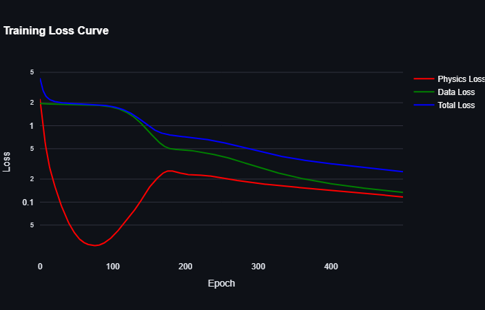
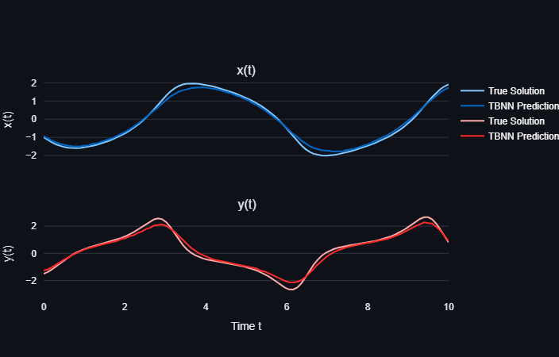
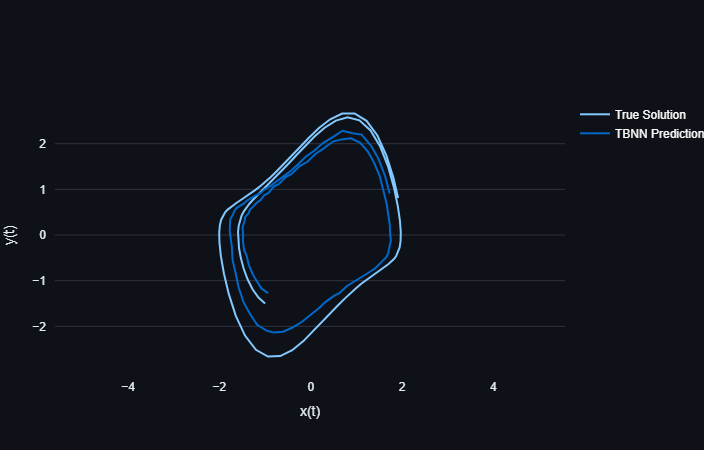

# Van der Pol Oscillator with Physics-Informed Tensor Basis Neural Network (TBNN)

This repository contains a Streamlit-based interactive dashboard that demonstrates how to train and evaluate a **Tensor Basis Neural Network (TBNN)** to learn the dynamics of the **Van der Pol oscillator**. The TBNN is trained using both data-driven loss (mean squared error) and physics-informed loss (residuals of the governing equations). After training, the model predicts trajectories for new initial conditions and compares them with true solutions.

## Overview

The Van der Pol oscillator is a nonlinear oscillator governed by the following ordinary differential equations (ODEs):

$$
\frac{dx}{dt} = y
$$
$$
\frac{dy}{dt} = \mu (1 - x^2)y - x
$$

Where:
- $x$ and $y$ are the state variables.
- $\mu$ is the damping parameter.
- $t$ is time.

The goal of this project is to:
1. Generate training data by solving the ODEs numerically for random initial conditions.
2. Train a TBNN to predict the state variables $x(t)$ and $y(t)$ for given initial conditions.
3. Evaluate the trained TBNN on new initial conditions and visualize the results in phase space and time series plots.

## Features

- **Physics-Informed Training**: Incorporates the residuals of the Van der Pol equations into the loss function to ensure physically consistent predictions.
- **Visualization**: Includes phase space trajectories and time series plots to compare TBNN predictions with true solutions.
- **Efficient Training**: Uses caching and session state to avoid redundant computations during training and evaluation.

---

## Installation

### Prerequisites

To run this app, you need the following Python libraries installed:

- `streamlit`
- `numpy`
- `scipy`
- `torch`
- `plotly`

You can install these dependencies using `pip`:

```bash
pip install streamlit numpy scipy torch plotly
```

### Running the App

You can try the app simply by clicking here. 

Alternatively, you can run the app locally by following these steps:
1. Clone this repository or download the script.
2. Open a terminal and navigate to the directory containing the script.
3. Run the Streamlit app:

```bash
streamlit run Van_der_Pol_TBNN.py
```

4. Open the provided local URL in your web browser to interact with the app.

---

## Usage

### Training the Model

1. Adjust the training parameters in the sidebar:
   - **Van der Pol Parameter ($\mu$)**: Controls the nonlinearity of the system.
   - **Number of Initial Conditions**: Number of random initial conditions used for training.
   - **Hidden Units**: Number of hidden units in the TBNN.
   - **Training Epochs**: Number of epochs for training the model.
2. Click the **"Train TBNN"** button to start training the model.
3. Monitor the training progress in the console and view the loss curve after training is complete.

### Evaluating the Model

1. Use the sliders to set new initial conditions ($x_0$, $y_0$).
2. The app will automatically evaluate the trained TBNN for the specified initial conditions.
3. View the results:
   - **Phase Space Plot**: Compares the predicted trajectory with the true solution in the phase space ($x(t)$ vs. $y(t)$).
   - **Time Series Plots**: Shows $x(t)$ and $y(t)$ as functions of time for both the true solution and the TBNN prediction.
   - **Mean Squared Error**: Displays the MSE between the true solution and the TBNN prediction.

---

## Example Outputs

### Loss Curve


### Time Series Comparison


### Phase Space Trajectory


### Mean Squared Error


---

## Notes

1. **Performance**:
   - Training may take longer for large numbers of initial conditions, hidden units, or epochs.
   - Use the default parameters for a quick demonstration.

2. **Caching**:
   - The app uses `st.cache_data` to cache the generation of training data and `st.session_state` to store the trained model, ensuring efficient performance.

3. **Dependencies**:
   - Ensure all required libraries are installed before running the app.

---

## Contributing

Contributions are welcome! If you find any issues or have suggestions for improvement, please open an issue or submit a pull request.

---

## License

This project is licensed under the MIT License. See the [LICENSE](LICENSE) file for details.

---

## Acknowledgments

- Inspired by physics-informed machine learning techniques for solving differential equations.
- Built using [Streamlit](https://streamlit.io/) for interactive visualization and [PyTorch](https://pytorch.org/) for neural network implementation.